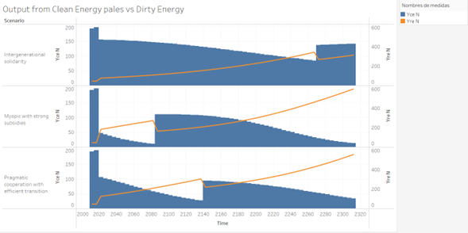
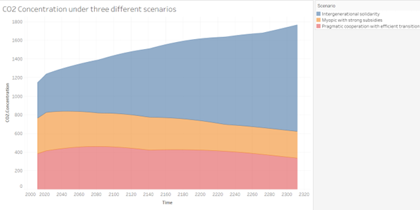
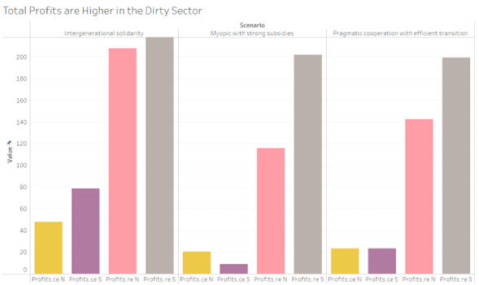

# Beyond Intergenerational Solidarity: Why Strong Climate Subsidies Matter (and maybe the most)
### By Ricardo Mauricio Gallardo Sánchez. 
### July, 2025

## Introduction

Conventional wisdom suggests that solving climate change requires prioritizing the future: making sacrifices today to benefit generations not yet born. This belief is embedded in many climate models and political narratives under the concept of intergenerational solidarity. But what if that’s not enough? What if, counterintuitively, valuing the future more doesn’t necessarily lead to better environmental outcomes?

Using the Exploratory Dynamic Integrated Assessment Model (EDIAM), I simulated three climate policy scenarios to explore the interplay between intertemporal preferences and technological subsidies. Surprisingly, the scenario most aligned with intergenerational solidarity resulted in the highest long-term CO2 concentrations . In contrast, scenarios featuring strong subsidies for clean technologies, even with moderate to high levels of short-termism, performed better in reducing emissions.

This blog dives into these findings and shows why, echoing Daron Acemoglu’s work, R&D support for clean energy must be both ambitious and well-targeted. Solidarity with future generations is important, but without concrete investment in innovation, it's not sufficient.

## 1. The Model and the Scenario Design

The EDIAM model simulates long-term economic and environmental dynamics between two world regions: a high-income "North" and a developing "South". It incorporates endogenous technology, fossil fuel use, and a social welfare function that can be tuned to represent different values of time preference (through `ρ`) and technology efficiency (through `ε` also, meaning elasticity of substitution between clean and dirty techs). Regarding this last point, a high elasticity of substitution means it's easier to switch from a dirty to a clean technology.

The three scenarios modeled are summarized below:

| Run.ID | ρ (Time Preference)     | ε (Elasticity of Substitution)     | Scenario Name                                      | Economic Interpretation                                                                                   |
|--------|--------------------------|--------------------------|---------------------------------------------------|-----------------------------------------------------------------------------------------------------------|
| 14893  | 0.001 (**Very low**)     | 3 (**Moderate**)         | **Intergenerational Solidarity with Moderate Transition** | Prioritizes long-term welfare, but implements only moderate technological progress mechanisms.         |
| 14877  | 0.009 (**Moderate**)     | 6.51 (**High**)          | **Pragmatic Cooperation with Efficient Transition** | Balances present and future gains, backed by efficient clean technology, easily substitued.        |
| 18240  | 0.015 (**High**)         | 10 (**Very High**)       | **Myopic Policy with Strong Subsidies**            | Prioritizes present gains, but uses aggressive R&D subsidies to drive rapid clean tech deployment.     |

## 2. Clean Energy Struggles Without Sufficient Support

In all scenarios, dirty energy dominates clean energy output, but the trajectory diverges significantly depending on the policy design:

- **Scenario 14893 (Intergenerational Solidarity)** sees a slight decline in clean energy output over time.
- **Scenario 18240 (Myopic with Strong Subsidies)** shows a continuous and rapid rise in clean energy production.

This confirms what Acemoglu et al. (2012) emphasize: clean sectors need substantial and persistent R&D subsidies. Relying on good intentions or long-term welfare metrics alone does not spur innovation or displace entrenched fossil fuel sectors.

## 3. Emissions Tell the Real Story

Perhaps the most surprising result is this: the scenario with the strongest intergenerational concern results in the highest CO2 concentrations over time.

Why? Without strong technology policies, valuing the future doesn’t translate into sufficient action. In EDIAM, mitigation depends on R&D effectiveness, not just on preferences. Scenario 14893 delays tech deployment, despite its long-term focus, which leads to sustained emissions.

By contrast, Scenario 18240, despite its high short-termism (high `ρ`), curbs emissions more effectively due to aggressive technological policy. It aligns with Acemoglu’s proposition that "a clean transition requires targeted policy distortions" to correct for the market’s underinvestment in innovation.

## 4. Profits Still Favor the Dirty Sector

Across all scenarios, total profits remain higher in the dirty energy sector, especially in the North. This reflects the model's assumption that fossil fuel technologies are mature and economically efficient.

However, the gap narrows in Scenario 18240, suggesting that*with strong enough subsidies, clean technologies can become competitive. Yet, without such support, as in Scenario 14893, clean energy remains a marginal activity.

## 5. Policy Design Matters: R&D Subsidies in Action

In Scenario 18240, both regions maintain high levels of R&D subsidies well into the future. This financial commitment is the key to the scenario’s success:

- The South, which typically lags in clean tech, receives sufficient support to scale up.
- The North maintains subsidies even with high `ρ`, showing that myopic preferences can still yield environmental benefits if complemented with the right tools.

By contrast, in Scenario 14893, R&D support is limited or mistimed—highlighting the dangers of relying on normative values without concrete economic levers.

## 6. Conclusions and Reflections

These simulations confirm a central but often overlooked idea: good intentions are not enough. Prioritizing the future, as in intergenerational solidarity, only yields results if matched with credible technological and fiscal strategies.

Acemoglu et al. (2012) warn against relying solely on carbon pricing or moral appeals. Instead, technology policy should be the cornerstone of climate action. Our results with EDIAM show that even under high myopia, strong R&D subsidies can substantially curb emissions and bridge the clean technology gap between North and South.

That being said, this excercise has several limitations: 
- EDIAM’s assumptions about tech progress and capital reallocation are stylized.
- Political feasibility of high subsidies, especially in developing economies, remains untested.
- Climate damages are modeled in a simplified way; future work could incorporate tipping points or climate shocks.

Still, the policy implication is clear: climate outcomes depend more on what we do than why we do it.

## References

- Acemoglu, D., Aghion, P., Bursztyn, L., & Hemous, D. (2012). *The Environment and Directed Technical Change*. American Economic Review, 102(1), 131–166. https://doi.org/10.1257/aer.102.1.131
- Molina-Perez, E. (2022). *Robust Climate Policy under Deep Uncertainty: An Application of Exploratory Modeling and Analysis*. Master's thesis, TU Delft. https://doi.org/10.4233/uuid:f72a0ea6-c271-4552-bf0c-5e1db4c4f1e4
- This work has been supported partially by OpenAI ChatGPT, specially by shaping instructions and guiding through git intricacies. The chat history is available here: https://chatgpt.com/share/686b3568-783c-8008-b38b-da46f492f6aa

